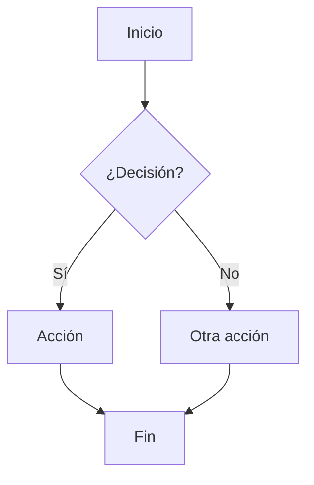

# Flujogramas del Hospital

Esta carpeta contiene todos los flujogramas de procesos del hospital.

## Estructura

```
Flujograma/
├── INSTRUCCIONES.md          # Guía completa para crear flujogramas
├── _plantilla/               # Plantilla base para nuevos flujogramas
│   ├── README.md            # Metadata y descripción
│   ├── flujograma.md        # Diagrama visual (Mermaid)
│   ├── documentacion.md     # Documentación detallada
│   └── versiones/           # Historial de versiones
└── [nombre-proceso]/        # Carpeta por cada proceso
    ├── README.md
    ├── flujograma.md
    ├── documentacion.md
    └── versiones/
```

## Índice de Flujogramas

| Proceso | Estado | Versión | Última Actualización |
|---------|--------|---------|---------------------|
| _Ejemplo próximamente_ | - | - | - |

## Cómo Crear un Nuevo Flujograma

### Paso 1: Lee las instrucciones
Consulta [INSTRUCCIONES.md](./INSTRUCCIONES.md) para entender el proceso completo.

### Paso 2: Describe el proceso
Proporciona al asistente:
- Nombre del proceso
- Descripción general
- Pasos principales
- Actores involucrados
- Puntos de decisión

### Paso 3: El asistente creará
- Carpeta del proceso
- Estructura de archivos basada en la plantilla
- Diagrama Mermaid
- Documentación completa

### Paso 4: Revisión y ajustes
- Revisa el flujograma generado
- Solicita cambios si es necesario
- Aprueba la versión final

### Paso 5: Sincronización
- El asistente hará commit
- Se sincronizará con GitHub
- Quedará documentado en el historial

## Formato Mermaid

Los flujogramas usan sintaxis Mermaid, que se renderiza automáticamente en GitHub.

**Ejemplo básico**:


## Tipos de Procesos

### Por Área
- 🏥 **Administrativos**: Admisión, alta, facturación
- 👨‍⚕️ **Clínicos**: Atención médica, diagnóstico, tratamiento
- 💊 **Farmacia**: Dispensación, control de medicamentos
- 🔬 **Laboratorio**: Toma de muestras, análisis, resultados
- 🚑 **Urgencias**: Triage, atención de emergencias
- 🏃 **Quirúrgicos**: Pre-operatorio, cirugía, post-operatorio

### Por Complejidad
- **Nivel 1**: Procesos simples (1-5 pasos)
- **Nivel 2**: Procesos moderados (6-15 pasos)
- **Nivel 3**: Procesos complejos (15+ pasos o múltiples actores)

## Convenciones

### Nomenclatura de carpetas
- Usar minúsculas
- Separar palabras con guiones: `admision-pacientes`
- Nombres descriptivos y concisos

### Versionamiento
- Guardar versiones anteriores en carpeta `versiones/`
- Nomenclatura: `flujograma-v1.0.md`, `flujograma-v1.1.md`
- Documentar cambios en `documentacion.md`

### Colores estándar
- 🔵 Azul: Inicio/Fin
- 🟡 Amarillo: Procesos normales
- 🔴 Rojo: Decisiones
- 🟢 Verde: Procesos automáticos/sistemas
- 🟣 Morado: Validaciones/controles

## Recursos

- [Sintaxis Mermaid](https://mermaid.js.org/syntax/flowchart.html)
- [Editor Mermaid Live](https://mermaid.live/)
- Plantilla base: [_plantilla/](./_plantilla/)

## Soporte

Para crear un nuevo flujograma, simplemente describe el proceso al asistente siguiendo el formato en [INSTRUCCIONES.md](./INSTRUCCIONES.md).

---

**¿Listo para comenzar?**
Describe el primer proceso que necesitas documentar y empecemos a construir tu flujograma.
