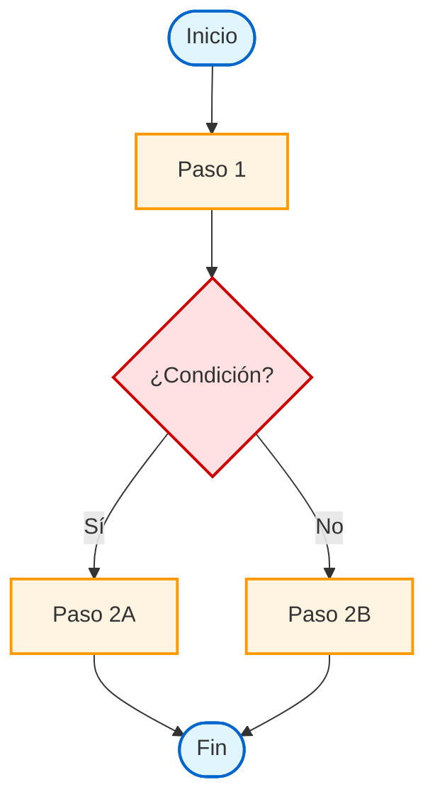

# Flujograma: [Nombre del Proceso]

## Diagrama Principal

## Leyenda

### Formas
- **Óvalo**: Inicio/Fin del proceso
- **Rectángulo**: Acción o proceso
- **Rombo**: Punto de decisión

### Colores
- 🔵 **Azul**: Inicio/Fin
- 🟡 **Amarillo**: Procesos/Acciones
- 🔴 **Rojo**: Decisiones

### Actores
- **[Actor 1]**: Responsable de [pasos específicos]
- **[Actor 2]**: Responsable de [pasos específicos]

## Notas del Diagrama

[Explicaciones adicionales sobre el flujo, casos especiales, o aclaraciones visuales]

---

**Última actualización**: [Fecha]
