# Flujograma: Admision Hospitalizado (Horizontal)
## Hospital Provincial de Ovalle Dr. Antonio Tirado Lanas

## Diagrama Principal - Vista Horizontal

```mermaid
%%{init: {'theme':'base', 'themeVariables': { 'primaryColor':'#E8BB00','primaryTextColor':'#000','primaryBorderColor':'#707372','lineColor':'#707372','secondaryColor':'#508FCF','tertiaryColor':'#42A095','fontSize':'13px','fontFamily':'Arial'}}}%%
flowchart LR
    Start([Paciente llega]) --> Login[Acceso ALMA]
    Login --> BuscarPac{Existe<br/>paciente?}

    BuscarPac -->|NO| CrearPac[Crear Paciente]
    BuscarPac -->|SI| VerPre{Tiene<br/>preadmision?}

    CrearPac --> DatosPac[Ingresar datos]
    DatosPac --> ActPac[Actualizar]

    VerPre -->|SI| ListaPre[Lista Preadmisiones]
    VerPre -->|NO| ActPac
    ListaPre --> SelPre[Seleccionar]
    SelPre --> ActPac

    ActPac --> RegEpi[Registro Episodio]
    RegEpi --> DatosEpi[Datos obligatorios]
    DatosEpi --> DecCama{Asignar<br/>cama?}

    DecCama -->|SI| SelCama[Seleccionar cama]
    DecCama -->|NO| EstEnf[Est. Enfermeria]

    SelCama --> Prevision[Prevision]
    EstEnf --> Prevision

    Prevision --> DecSeg{Seguros<br/>adicionales?}
    DecSeg -->|SI| IngSeg[Registrar seguros]
    DecSeg -->|NO| GuardarEpi[Guardar]

    IngSeg --> GuardarSeg[Guardar seguros]
    GuardarSeg --> GuardarEpi

    GuardarEpi --> Alertas{Alertas?}
    Alertas -->|Extra-Servicio| ConfAlerta1[Confirmar]
    Alertas -->|Prevision| ConfAlerta2[Confirmar]
    Alertas -->|Sin alertas| PacReg[Registrado]

    ConfAlerta1 --> PacReg
    ConfAlerta2 --> PacReg

    PacReg --> Estadia[ESTADIA]
    Estadia --> AltaMed{Alta<br/>medica?}

    AltaMed -->|NO| Estadia
    AltaMed -->|SI| AltaAdm[Alta Admin]
    AltaAdm --> FormAlta[Form. Alta]
    FormAlta --> ActAlta[Actualizar]
    ActAlta --> End([Dado de alta])

    %% Estilos institucionales Hospital Provincial de Ovalle
    classDef startEnd fill:#E8BB00,stroke:#707372,stroke-width:3px,color:#000
    classDef busqueda fill:#508FCF,stroke:#003E8C,stroke-width:2px,color:#fff
    classDef registro fill:#E8BB00,stroke:#D37F22,stroke-width:2px,color:#000
    classDef prevision fill:#AD90BE,stroke:#7A6CA6,stroke-width:2px,color:#000
    classDef decision fill:#D3006A,stroke:#AD90BE,stroke-width:2px,color:#fff
    classDef sistema fill:#42A095,stroke:#A5CBCA,stroke-width:2px,color:#000
    classDef alta fill:#D37F22,stroke:#707372,stroke-width:2px,color:#fff

    class Start,End startEnd
    class BuscarPac,Login busqueda
    class CrearPac,DatosPac,ActPac,RegEpi,DatosEpi registro
    class Prevision,IngSeg,GuardarSeg prevision
    class DecCama,DecSeg,Alertas,AltaMed decision
    class GuardarEpi,ConfAlerta1,ConfAlerta2,PacReg,Estadia sistema
    class AltaAdm,FormAlta,ActAlta alta
    class SelCama,EstEnf registro
```

## Notas

Este diagrama presenta la misma información que la versión vertical, pero optimizado para:
- Presentaciones en pantallas anchas
- Proyecciones
- Documentos en formato horizontal (landscape)

Los textos han sido simplificados para mejor legibilidad en formato horizontal.

---

**Hospital Provincial de Ovalle - Dr. Antonio Tirado Lanas**
**Ultima actualizacion**: 2025-11-13
**Version**: 1.1 (Formato horizontal con colores institucionales)
