# Flujograma: Admision Hospitalizado
## Hospital Provincial de Ovalle Dr. Antonio Tirado Lanas

## Diagrama Principal

```mermaid
%%{init: {'theme':'base', 'themeVariables': { 'primaryColor':'#E8BB00','primaryTextColor':'#000','primaryBorderColor':'#707372','lineColor':'#707372','secondaryColor':'#508FCF','tertiaryColor':'#42A095','fontSize':'14px','fontFamily':'Arial'}}}%%
flowchart TD
    Start([Paciente llega para<br/>hospitalizacion]) --> Login[Personal accede a ALMA<br/>Perfil: Admision Hospitalizado]

    Login --> BuscarPac{Paciente existe<br/>en sistema?}

    BuscarPac -->|NO| CrearPac[Crear nuevo paciente<br/>Formulario: Registro Pacientes]
    BuscarPac -->|SI| VerPre{Tiene<br/>preadmision?}

    CrearPac --> DatosPac[Ingresar datos:<br/>- RUN/Identificacion<br/>- Nombres y apellidos<br/>- Fecha nacimiento<br/>- Domicilio<br/>- Prevision base]

    DatosPac --> ActPac[Actualizar registro]

    VerPre -->|SI| ListaPre[Consultar Lista<br/>de Preadmisiones]
    VerPre -->|NO| ActPac

    ListaPre --> SelPre[Seleccionar solicitud<br/>pendiente del paciente]
    SelPre --> ActPac

    ActPac --> RegEpi[Abrir Formulario<br/>Registro del Episodio]

    RegEpi --> DatosEpi[Completar datos obligatorios:<br/>- Establecimiento<br/>- Fecha/Hora registro<br/>- Unidad/Servicio<br/>- Especialidad<br/>- Procedencia paciente<br/>- Motivo hospitalizacion]

    DatosEpi --> DecCama{Asignar<br/>cama ahora?}

    DecCama -->|SI| SelCama[Seleccionar:<br/>Sala - Habitacion - Cama]
    DecCama -->|NO| EstEnf[Paciente queda en:<br/>Estacion Enfermeria o<br/>Sala de Espera]

    SelCama --> Prevision[Formulario:<br/>Detalles de Prevision]
    EstEnf --> Prevision

    Prevision --> DecSeg{Tiene seguros<br/>adicionales?}

    DecSeg -->|SI| IngSeg[Registrar seguros:<br/>- Tipo seguro/programa<br/>- Cobertura<br/>- Vigencia<br/>- Observaciones]
    DecSeg -->|NO| GuardarEpi

    IngSeg --> GuardarSeg[Guardar seguros<br/>en lista]
    GuardarSeg --> GuardarEpi[Guardar Episodio<br/>Boton: Actualizar]

    GuardarEpi --> Alertas{Sistema<br/>genera alertas?}

    Alertas -->|Paciente Extra-Servicio| ConfAlerta1[Confirmar alerta]
    Alertas -->|Actualizar prevision| ConfAlerta2[Confirmar alerta]
    Alertas -->|Sin alertas| PacReg

    ConfAlerta1 --> PacReg
    ConfAlerta2 --> PacReg

    PacReg[Paciente Registrado<br/>Visible en Mapa de Piso]

    PacReg --> Estadia[ESTADIA HOSPITALARIA]

    Estadia --> Consultas[Consultas disponibles:<br/>- Pacientes Actuales<br/>- Servicios Clinicos<br/>- Archivo FC]

    Estadia --> AltaMed{Medico autoriza<br/>Alta Medica?}

    AltaMed -->|NO| Estadia
    AltaMed -->|SI| AltaAdm[Proceso Alta<br/>Administrativa]

    AltaAdm --> FormAlta[Formulario Alta del Episodio<br/>- Fecha/Hora alta<br/>- Establecimiento referencia<br/>- Destino egreso]

    FormAlta --> ActAlta[Actualizar Alta]

    ActAlta --> End([Paciente dado de alta<br/>Sale del Mapa de Piso])

    %% Estilos institucionales Hospital Provincial de Ovalle
    classDef startEnd fill:#E8BB00,stroke:#707372,stroke-width:3px,color:#000
    classDef busqueda fill:#508FCF,stroke:#003E8C,stroke-width:2px,color:#fff
    classDef registro fill:#E8BB00,stroke:#D37F22,stroke-width:2px,color:#000
    classDef prevision fill:#AD90BE,stroke:#7A6CA6,stroke-width:2px,color:#000
    classDef decision fill:#D3006A,stroke:#AD90BE,stroke-width:2px,color:#fff
    classDef sistema fill:#42A095,stroke:#A5CBCA,stroke-width:2px,color:#000
    classDef alta fill:#D37F22,stroke:#707372,stroke-width:2px,color:#fff

    class Start,End startEnd
    class BuscarPac,Login busqueda
    class CrearPac,DatosPac,ActPac,RegEpi,DatosEpi registro
    class Prevision,IngSeg,GuardarSeg prevision
    class DecCama,DecSeg,Alertas,AltaMed decision
    class GuardarEpi,ConfAlerta1,ConfAlerta2,PacReg,Estadia sistema
    class AltaAdm,FormAlta,ActAlta alta
    class SelCama,EstEnf,Consultas registro
```

## Leyenda - Colores Institucionales

### Formas
- **Ovalo**: Inicio/Fin del proceso
- **Rectangulo**: Accion o proceso
- **Rombo**: Punto de decision

### Colores por Tipo de Actividad (Colores Hospital Provincial de Ovalle)
- 🟡 **Amarillo (#E8BB00)**: Inicio/Fin del proceso y registro de datos
- 🔵 **Azul (#508FCF)**: Busqueda y acceso al sistema
- 🟣 **Morado (#AD90BE)**: Gestion de prevision y seguros
- 🔴 **Magenta (#D3006A)**: Puntos de decision
- 🟢 **Verde azulado (#42A095)**: Acciones del sistema (guardar, alertas)
- 🟠 **Naranja (#D37F22)**: Proceso de alta

### Actores por Seccion

| Seccion | Actor Principal | Sistema |
|---------|----------------|---------|
| Busqueda/Creacion paciente | Personal Admision | ALMA |
| Registro episodio | Personal Admision | ALMA |
| Asignacion cama | Personal Admision | ALMA |
| Prevision y seguros | Personal Admision | ALMA |
| Validaciones | - | ALMA (alertas) |
| Estadia | Consulta solo | ALMA |
| Alta administrativa | Personal Admision | ALMA |

## Notas del Diagrama

### Campos Obligatorios Minimos
- RUN o identificacion del paciente
- Nombres y apellidos completos
- Fecha de nacimiento
- Sexo
- Establecimiento
- Fecha y hora de registro
- Unidad/Servicio
- Especialidad
- Prevision base

### Alertas Comunes del Sistema
1. **Paciente Extra-Servicio**: Cuando unidad/servicio no coincide con especialidad
2. **Actualizar prevision**: Recordatorio para verificar datos previsionales
3. **Documentos pendientes**: Faltan antecedentes por completar

### Casos Especiales No Mostrados
- **Fusion de Registros**: Unificar pacientes duplicados o NN identificados
- **Gestion Archivo FC**: Envio/recepcion de fichas clinicas entre unidades
- **Pacientes GO**: Registro adicional de Fecha Probable de Parto

### Tiempos Estimados
- Registro nuevo paciente completo: 5-10 minutos
- Admision con preadmision existente: 3-5 minutos
- Alta administrativa: 2-3 minutos

---

**Hospital Provincial de Ovalle - Dr. Antonio Tirado Lanas**
**Ultima actualizacion**: 2025-11-13
**Version**: 1.1 (Colores institucionales aplicados)
